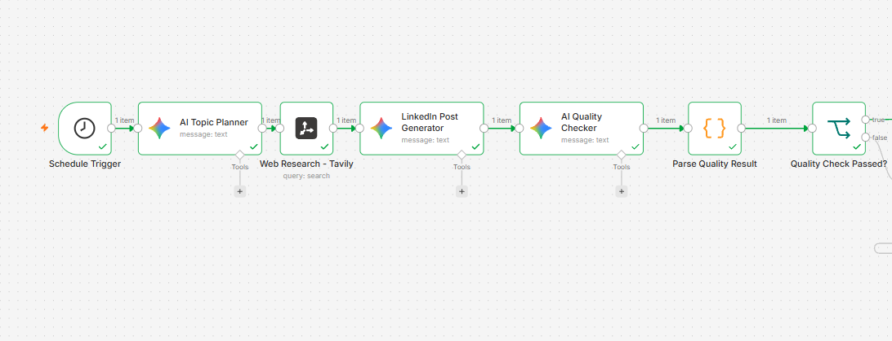
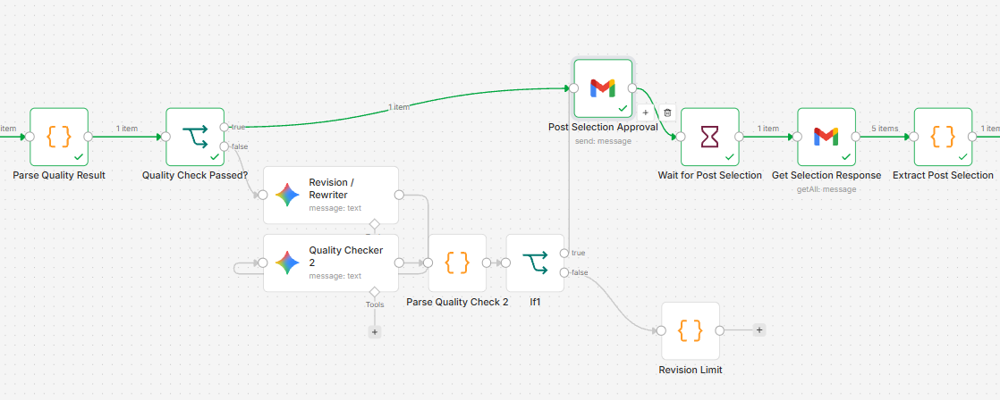
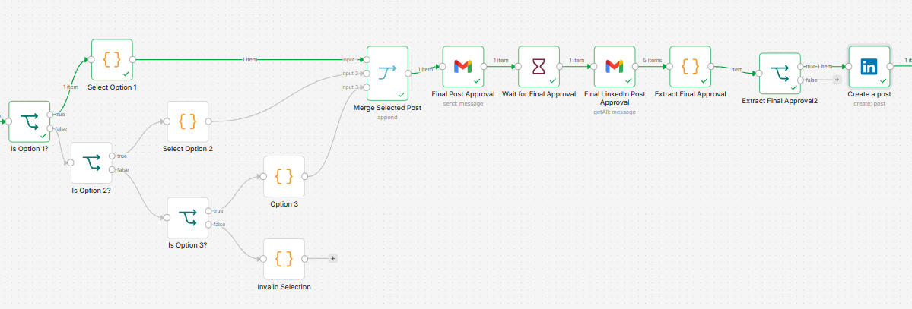

# AI Powered LinkedIn Content Automation with Human Approval

An n8n workflow that automates the LinkedIn content creation process from topic research to final publishing.

The workflow uses AI to plan a topic, research relevant information, generate multiple LinkedIn post options, evaluate the content, request human approval, and publish the selected post to LinkedIn.

## Overview

The main goal of this project was to build a practical AI automation workflow rather than a simple AI content generator.

The workflow combines AI models, web research, conditional logic, human approval, email communication, JavaScript data processing, and LinkedIn publishing.

The final publishing decision remains with a human.

## Workflow

```text
Schedule Trigger
       |
       v
AI Topic Planner
       |
       v
Web Research with Tavily
       |
       v
LinkedIn Post Generator
       |
       v
AI Quality Checker
       |
       v
Quality Check
    /       \
Revise     Continue
   |          |
   v          v
Recheck   Human Selection
              |
              v
       Selected Post
              |
              v
       Final Approval
          /       \
      Reject     Approve
                   |
                   v
          Publish to LinkedIn
```

## Main Features

1. AI based topic planning

2. Web research using Tavily

3. Generation of three different LinkedIn post options

4. Automated AI quality checking

5. Automatic revision when content requires changes

6. Human selection of the preferred post

7. Email based approval

8. Webhook based workflow waiting

9. Conditional branching using n8n

10. JavaScript based JSON parsing and data extraction

11. Final human approval before publishing

12. Automatic LinkedIn publishing

## How It Works

### 1. Topic Planning

The workflow begins with a scheduled trigger.

Google Gemini creates a content strategy for the LinkedIn post, including the topic, content angle, target audience, relevance, and a potential practical example.

### 2. Web Research

Tavily searches the web for information related to the selected topic.

The research is provided to the content generation step as reference material so the generated posts can be based on relevant information rather than relying only on the language model.

### 3. LinkedIn Post Generation

The workflow generates three different LinkedIn post options.

The three approaches are:

1. Educational

2. Practical scenario

3. Thought provoking

The prompts are designed to keep the writing natural and professional while avoiding fabricated personal experiences, unsupported statistics, excessive buzzwords, and generic AI style writing.

### 4. AI Quality Control

A separate AI quality checker reviews the generated posts.

The checker evaluates factors such as factual support, writing quality, post length, hashtags, unsupported claims, placeholders, and whether the three options provide genuinely different perspectives.

If the content requires revision, it is sent through a revision and rechecking process.

### 5. Human Selection

Once the content passes the quality check, the three post options are sent by email.

The user selects one of the three options.

The workflow then identifies the selected option and routes it through the appropriate branch.

### 6. Final Approval

The selected post is sent for a final human approval before publishing.

The workflow waits for the approval response.

Only an explicit approval allows the workflow to continue to LinkedIn.

### 7. LinkedIn Publishing

After final approval, the selected post is sent to LinkedIn through the LinkedIn integration.

This completes the automated content workflow while keeping human control over the final publishing decision.

## Workflow Screenshots

### Content Generation and Research



This section shows the topic planning, web research, LinkedIn post generation, and initial quality checking stages.

### Quality Control and Human Selection



This section shows the quality control path, revision process, human post selection, and routing between the three generated options.

### Final Approval and LinkedIn Publishing



This section shows the selected post being merged, sent for final approval, and published to LinkedIn after approval.

## Technologies

1. n8n

2. Google Gemini

3. Tavily

4. Gmail

5. LinkedIn

6. JavaScript

7. REST APIs

## What I Learned

This project gave me practical experience with building an end to end AI automation workflow.

Key areas I worked with include:

1. Workflow orchestration with n8n

2. LLM based content generation

3. Web research APIs

4. Prompt design

5. JSON parsing

6. Conditional logic

7. Human in the loop automation

8. Webhook based workflow execution

9. API integrations

10. LinkedIn publishing

11. Error handling and validation

## Human in the Loop

Human approval is intentionally included at two stages of the workflow.

First, the user selects which generated post should be used.

Second, the user reviews the selected post and gives final approval before it is published.

This prevents the workflow from making the final publishing decision without human review.

## Future Enhancements

### AI Generated Visuals

An earlier version of the project explored automatically generating a visual based on the selected LinkedIn post.

Several image generation services were evaluated, but the available free API access was not suitable for the current implementation.

Image generation was therefore kept as a future enhancement rather than introducing a paid dependency into the core workflow.

Other possible enhancements include LinkedIn scheduling, analytics collection, engagement analysis, additional approval channels, and support for other social platforms.

## Project Status

The core LinkedIn content automation workflow is complete.

It can move from topic planning and research through AI content generation, quality checking, human selection, final approval, and LinkedIn publishing.

## Repository Structure

```text
ai-linkedin-automation/
│
├── README.md
│
├── workflow/
│   └── linkedin-content-automation.json
│
└── screenshots/
    ├── 01-content-generation-workflow.png
    ├── 02-quality-control-and-selection.png
    └── 03-approval-and-linkedin-publishing.png
```

