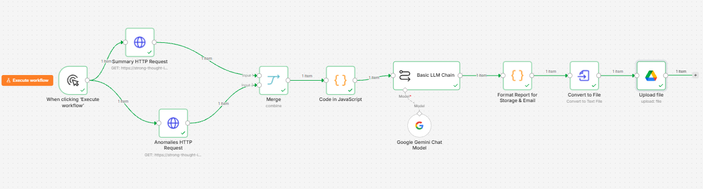

# AI-Powered Development Program Monitoring & Reporting Automation Platform

An end-to-end portfolio project demonstrating how development-program monitoring data can be validated, analyzed, monitored for anomalies, and transformed into management-ready reports through Python, PostgreSQL, REST APIs, n8n, and Google Gemini.

> **Portfolio note:** This project uses synthetic development-program monitoring data. It is designed to demonstrate technical patterns relevant to development-sector and public-interest programme monitoring; it is not an official UNDP system or UNDP-approved implementation.

---

## Project Overview

Development programmes often collect monitoring information from multiple districts, training centres, and programme types. Turning that information into reliable management insight requires more than simply storing records.

This project demonstrates an automated monitoring pipeline that:

1. Processes structured programme monitoring data.
2. Validates data quality using deterministic rules.
3. Separates valid records from records requiring review.
4. Stores structured monitoring information in PostgreSQL.
5. Calculates programme KPIs.
6. Detects potentially unusual performance patterns.
7. Exposes monitoring results through REST API endpoints.
8. Uses n8n to orchestrate the reporting workflow.
9. Uses Google Gemini to convert verified metrics into a management-oriented narrative.
10. Converts the generated report into a file and stores it in Google Drive.
11. Keeps human review in the loop for important monitoring decisions.

The architecture deliberately separates **calculation and validation from AI-generated communication**.

---

## System Architecture

```text
Synthetic Monitoring Data
          |
          v
+-------------------------+
| Python Data Layer       |
| Validation & Cleaning   |
+-------------------------+
          |
          +------ Invalid / Review Records
          |
          v
+-------------------------+
| PostgreSQL              |
| Monitoring Data         |
| Validation Results      |
| KPI Results             |
| Anomalies               |
+-------------------------+
          |
          v
+-------------------------+
| KPI & Anomaly Analysis  |
+-------------------------+
          |
          v
+-------------------------+
| REST API                |
| Verified Monitoring     |
| Results                 |
+-------------------------+
          |
          v
+-------------------------+
| n8n Orchestration       |
+-------------------------+
          |
          v
+-------------------------+
| Google Gemini           |
| Report Narrative        |
+-------------------------+
          |
          v
+-------------------------+
| Automated Report        |
+-------------------------+
          |
          v
+-------------------------+
| Google Drive            |
+-------------------------+
```

### Core Architecture Principle

The project follows a simple governance principle:

> **Code calculates. Data rules validate. AI communicates. Humans remain responsible for decisions.**

The AI model is not responsible for calculating official KPIs or deciding whether an anomaly is a confirmed programme problem. It receives verified information and produces a readable management narrative.

---

## n8n Automation Workflow

The implemented n8n workflow orchestrates the reporting pipeline from verified API data through automated report generation and storage.



### Workflow sequence

```text
Manual Workflow Trigger
        |
        +--------------------+
        |                    |
        v                    v
   Summary API         Anomalies API
        |                    |
        +---------+----------+
                  |
                  v
                Merge
                  |
                  v
           KPI Aggregation
                  |
                  v
            Google Gemini
                  |
                  v
             Format Report
                  |
                  v
             Convert to File
                  |
                  v
              Google Drive
```

### Responsibilities by layer

- **REST API / Python:** provides verified monitoring metrics and anomaly information.
- **JavaScript:** combines and prepares structured KPI information.
- **Google Gemini:** generates a management-oriented narrative from supplied verified data.
- **n8n:** orchestrates the end-to-end workflow.
- **Google Drive:** stores the generated monitoring report.

---

## Technology Stack

| Layer | Technology |
|---|---|
| Programming | Python |
| Data Processing | Pandas |
| Database | PostgreSQL |
| API | Python REST API |
| Workflow Automation | n8n Cloud |
| AI / LLM | Google Gemini |
| Storage / Delivery | Google Drive |
| Data Formats | CSV, JSON |
| Query Language | SQL |
| Testing | Python test suite |
| Version Control | Git / GitHub |

---

## Monitoring Dataset

The portfolio dataset contains **1,800+ synthetic development-program monitoring records** representing programme-level and training-centre-level monitoring information.

Example fields include:

- Record ID
- Reporting month
- Reporting date
- Submission date
- District
- Training centre
- Programme type
- Participants enrolled
- Participants completed
- Participants in progress
- Participants dropped
- Employment outcomes
- Trainer count
- Training hours
- Budget allocated
- Budget spent
- Data source

Programme categories include:

- Career Readiness
- Vocational Training
- Digital Skills
- Entrepreneurship

The dataset intentionally contains realistic data-quality problems so that the validation and monitoring pipeline can demonstrate how a production-oriented system should behave when imperfect data arrives.

---

## Data Validation

The validation layer uses deterministic rules rather than an LLM.

Examples of validation checks include:

- Required-field validation
- Duplicate record detection
- Negative participant values
- Negative budget values
- Completion greater than enrolment
- Dropout greater than enrolment
- Participant components exceeding total enrolment
- Employment outcomes exceeding completed participants
- Budget spent exceeding allocated budget
- Invalid dates
- Unknown district or training-centre references
- Invalid trainer counts

Records that fail validation can be identified and separated for review rather than silently entering downstream analysis.

This approach is particularly important for monitoring workflows because incorrect source data can otherwise produce misleading KPIs and management conclusions.

---

## Database Architecture

PostgreSQL provides the structured persistence layer for the monitoring platform.

The project uses relational structures for monitoring data, training-centre information, validation findings, audit information, KPI results, and anomaly results.

Key database concepts include:

- Programme monitoring records
- Training-centre reference data
- Validation findings
- Audit information
- Aggregated KPI results
- Anomaly records

This separation supports traceability between source monitoring data, quality checks, calculated indicators, and management reporting.

---

## KPI Monitoring

The KPI layer calculates monitoring indicators from verified data.

Example indicators include:

- Total participants enrolled
- Total participants completed
- Total participants dropped
- Completion rate
- Dropout rate
- Employment outcome rate
- Budget allocated
- Budget spent
- Budget utilization
- Data-quality score

Example portfolio run:

| Indicator | Result |
|---|---:|
| KPI result rows | 1,184 |
| Participants enrolled | 108,521 |
| Participants completed | 80,901 |
| Participants dropped | 14,404 |
| Average completion rate | 74.62% |
| Average dropout rate | 13.31% |
| Average employment outcome rate | 44.69% |
| Average data-quality score | 99.51% |

These values are generated upstream by deterministic processing and supplied to the AI reporting layer.

---

## Anomaly Detection

The platform identifies monitoring signals that may require management review.

Example anomaly indicators include:

- Budget utilization above 100%
- High dropout rates
- Other threshold-based performance deviations

Example portfolio run:

| Anomaly indicator | Result |
|---|---:|
| Total anomalies | 607 |
| High severity | 433 |
| Medium severity | 174 |
| Low severity | 0 |
| Pending review | 607 |

An anomaly is treated as a **signal for investigation**, not as proof of misconduct, failure, or an incorrect programme decision.

---

## REST API Layer

The API layer makes verified monitoring information available to the automation workflow.

The implemented monitoring workflow uses API endpoints for:

```text
GET /api/health
GET /api/summary
GET /api/anomalies/summary
```

The health endpoint supports basic service/database connectivity checking, while the summary endpoints provide monitoring and anomaly information consumed by n8n.

---

## AI-Assisted Reporting

Google Gemini is used as a reporting and communication layer.

The model receives structured KPI and anomaly information that has already been calculated by the data-processing layer.

The reporting prompt is designed to:

- Use supplied KPI values exactly.
- Avoid inventing numerical values.
- Avoid recalculating official metrics.
- Present anomalies as signals pending human review.
- Avoid making unsupported recommendations.
- Use a professional management tone.
- Focus on programme monitoring information.
- Keep the narrative understandable to non-technical stakeholders.

This creates a practical distinction between **AI-assisted reporting** and **AI-controlled decision making**.

---

## Human-in-the-Loop Governance

The system is intentionally designed so that automated anomaly detection does not automatically trigger high-impact decisions.

The workflow can identify:

> "This record or indicator may require attention."

It does not automatically conclude:

> "This programme has failed."

Human review remains necessary before operational, financial, or programme-management action is taken.

This design supports responsible use of AI in monitoring environments where context and institutional judgement matter.

---

## Responsible AI Considerations

The project demonstrates several responsible-AI principles:

### 1. Human oversight

AI-generated narratives support human decision-makers rather than replacing them.

### 2. Traceability

The underlying KPI and anomaly values originate from deterministic processing before reaching the LLM.

### 3. Controlled AI scope

The LLM is used for summarization and communication rather than authoritative calculation.

### 4. No fabricated metrics

The reporting prompt explicitly instructs the model not to invent or alter numerical values.

### 5. Anomalies are signals

An anomaly does not automatically represent fraud, failure, or poor performance.

### 6. Synthetic data

The portfolio uses synthetic data rather than confidential beneficiary or programme records.

---

## Example Automated Reporting Flow

```text
Monitoring Data
      |
      v
Validation
      |
      v
Verified Metrics
      |
      +------------------+
      |                  |
      v                  v
   KPI Results       Anomaly Results
      |                  |
      +--------+---------+
               |
               v
             n8n
               |
               v
         Google Gemini
               |
               v
       Management Report
               |
               v
          Google Drive
```

This demonstrates how a monitoring workflow can move from structured data to a reusable management output without requiring every step to be performed manually.

---

## Project Structure

```text
development-monitoring-ai-automation/
|
├── dashboard/
│
├── data/
│   ├── processed/
│   └── raw/
│
├── docs/
│   ├── architecture.md
│   ├── data_dictionary.md
│   ├── n8n_workflow.png
│   ├── responsible_ai.md
│   ├── testing.md
│   └── validation_rules.md
│
├── n8n/
│   └── monitoring_workflow.json
│
├── python/
│   ├── anomaly_detection.py
│   ├── api.py
│   ├── cleaning.py
│   └── kpi_calculation.py
│
├── reports/
│
├── sql/
│   └── schema.sql
│
├── tests/
│
├── .gitignore
├── README.md
└── requirements.txt
```

---

## Automation vs. Traditional Manual Workflow

### Traditional approach

```text
Collect files
    ↓
Manually inspect data
    ↓
Manually calculate KPIs
    ↓
Search for unusual values
    ↓
Write management summary
    ↓
Export report
    ↓
Upload/send report
```

### Automated approach

```text
Monitoring data
    ↓
Automated validation
    ↓
Automated KPI calculation
    ↓
Automated anomaly detection
    ↓
API exposure
    ↓
n8n orchestration
    ↓
AI-assisted narrative
    ↓
Automated report creation
    ↓
Google Drive
```

The main benefit is not simply "using AI." The value comes from combining **data quality, deterministic analytics, workflow automation, and controlled AI-assisted communication** into one repeatable pipeline.

---

## Development-Sector Relevance

The architecture is relevant to development-programme monitoring because it addresses recurring operational needs such as:

- Monitoring programme implementation across locations
- Tracking participant outcomes
- Comparing planned and actual financial performance
- Detecting data-quality problems
- Identifying indicators requiring management attention
- Producing repeatable monitoring reports
- Maintaining traceability between source data and reported metrics
- Supporting human review rather than fully automated decisions

The same architecture could be adapted for areas such as:

- Skills and employment programmes
- Education initiatives
- Livelihood programmes
- Youth development
- Training programmes
- Community development
- Programme implementation monitoring
- Results-based management workflows

This project is a technical portfolio demonstration and does not claim official affiliation, endorsement, or compliance with any specific organization.

---

## Future Extensions

Possible future improvements include:

- Event-driven ingestion of new monitoring submissions
- Additional role-based dashboards
- Authentication and authorization
- More granular programme-level KPIs
- Historical trend analysis
- Forecasting
- Explainable anomaly scoring
- Automated notification routing
- Data-source connectors
- Metadata and lineage tracking
- Production deployment with secure secrets management

These are intentionally outside the current portfolio scope; the current implementation focuses on demonstrating the core monitoring and automation architecture.

---

## Skills Demonstrated

### Data Engineering

- Data validation
- Data cleaning
- Relational data modelling
- PostgreSQL
- SQL
- Data-quality controls

### Analytics

- KPI calculation
- Rate calculation
- Threshold-based anomaly detection
- Aggregation
- Monitoring indicators

### Automation

- n8n
- REST APIs
- JSON
- Webhooks/API concepts
- Automated file generation
- Google Drive integration

### AI Engineering

- LLM integration
- Prompt design
- Structured-data-to-narrative workflows
- Controlled AI scope
- Human-in-the-loop design
- Responsible AI considerations

### Software Engineering

- Python
- Modular scripts
- API development
- Testing
- Git/GitHub
- Environment and dependency management

---

## Portfolio Summary

Built an end-to-end AI-powered development-program monitoring and reporting platform that combines **Python, PostgreSQL, REST APIs, n8n, and Google Gemini** to validate **1,800+ monitoring records**, calculate programme KPIs, detect anomalies, generate management reports, and automate report delivery while maintaining human oversight for important decisions.

---

## Disclaimer

This project is an independent portfolio project using synthetic data. It is not an official UNDP system, UNDP product, UNDP dataset, or UNDP-approved implementation.
